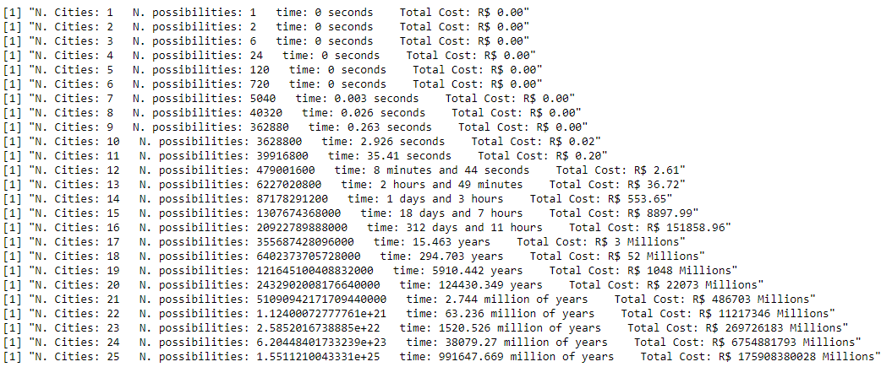

# TSP-Brute-Force-Time-Consumption
R program to estimate time consumpution of Brute Force in TSP (Traveling Salesman Problem)
 

see the script in: https://github.com/LucasLP/TSP-Brute-Force-Time-Consumption/blob/master/Script.R 
 
You can execute it online with http://rextester.com/l/r_online_compiler
 
This code is also implemented in javascript, test in this web application: https://lucaslp.github.io/jtsp.html

 
For your cenario you can set:
<ul>
  <li>cities</li>
  <li>currency</li>
  <li>Kilo watt hour</li>
  <li>CPU info
    <ul>
      <li>GHz</li>
      <li>cores</li>
      <li>TDP</li>
    </ul>
  </li>
  <li>Number of parallel CPUs</li>
</ul>
 
 
